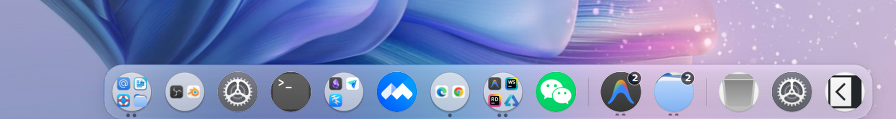

# kde-quickshell-dock

A Quickshell dock for KDE Plasma 6 (Wayland) in the style of the macOS Dock:
your Plasma favourites plus whatever is running, with parabolic hover
magnification, frosted glass and drag-to-reorder.



## What it does

- Reads the **Favorites** list out of Plasma's Application Launcher (Kickoff) —
  from the KActivities database Plasma actually keeps it in, not the stale copy
  in `appletsrc` (see [Where favourites live](#where-favourites-live)).
- Resolves `preferred://browser`, `preferred://filemanager`, `preferred://mailer`
  and `preferred://terminal` the same way Plasma does, via `kdeglobals` and
  `mimeapps.list`.
- Skips favourites whose application isn't installed, instead of showing a
  broken icon.
- **Drag to reorder.** Neighbours slide aside as you drag; the order is saved and
  restored on next launch.
- **macOS-style look and motion**: cosine-wave hover magnification across
  neighbouring icons, bounce on launch, frosted glass plate with a specular top
  edge, light and dark presets, and any of the four screen edges.
- **Knows what's running**: a dot under each running app, click to raise (or
  minimize the focused single window), unpinned running apps shown too, and the
  icon's geometry is published to KWin for the Magic Lamp minimize effect (see
  [Running applications](#running-applications)).
- **Multi-window apps expand inline**: clicking an app with several windows
  opens a row of window cards beside it — app icon, cleaned-up window title,
  focus/minimized state, and a close button. When the dock gets wider than the
  screen it scrolls horizontally with the wheel or touchpad.
- **Right-click menu** per app: recent files for that app, its desktop actions,
  new window, pin / unpin from Kickoff favourites, or move into application folders.
- **App Folders (应用文件夹)**: Group applications into custom folders directly on the
  dock. Folders display an authentic adaptive 2×2 / 3×3 mini-grid of contained app icons.
  Clicking a folder opens a frosted-glass popup panel to launch apps, rename inline,
  add applications via a searchable picker, or drag-and-drop apps directly into the folder.
- **Trash** cell: click to open, right-click to empty — with a confirmation that
  shows the item count, done through KIO (see [Trash](#trash)).
- **Settings panel** behind the gear cell for every option below, with optional
  **per-screen** configuration; drag the separator line to resize the icons.
- **Auto-hide** that never disappears completely — the dock slides down to a
  thin sliver at the screen edge and comes back when the pointer touches it.
- Picks up favourite changes live — favourite something in Kickoff and it
  appears without a restart.
- Resolves icons through a fallback chain, so absolute-path and
  oddly-named icons still render (see [Icons](#icons)).
- With `edgeCorners`, drawn as a single stroked path that blends into the screen
  edge with inverted corners (see [The dock outline](#the-dock-outline)).

## Requirements

- Quickshell (developed against 0.3.1; also runs on the noctalia-qs fork)
- A compositor supporting `wlr-layer-shell` (KWin on Plasma 6 does)
- Plasma's `org.kde.taskmanager` QML module, from `plasma-workspace`, for the
  running-application features
- One extra install step to let KWin tell the dock what's running — see
  [Running applications](#running-applications). Without it everything else
  still works; the dock just behaves as a plain launcher.
- Optional helpers, each degrading gracefully when absent: `ktrash6` or `gio`
  and `kioclient` (trash), `sqlite3` or `python3` (Kickoff favourites),
  `python3` (recent files), `gdbus` (live favourite updates, pin/unpin).

## Installing

```sh
./scripts/install.sh
```

This checks the dependencies above, installs the KWin permission file (see
[The KWin permission](#the-kwin-permission)) with `Exec=` pointing at your real
quickshell binary, adds an autostart entry, and (re)starts the dock. Everything
goes under `$HOME`; the dock runs straight from this checkout, so `git pull` is
the update.

| Command | Effect |
| --- | --- |
| `./scripts/install.sh` | Install and start, with autostart |
| `./scripts/install.sh --no-autostart` | Same, without the autostart entry |
| `./scripts/install.sh check` | Only report missing dependencies |
| `./scripts/install.sh uninstall` | Stop the dock, remove the permission and autostart files (settings are kept) |

If the running-app dots don't show up right after installing, log out and back
in once — KWin only consults the permission file for clients it sees start
afterwards.

To run it by hand instead, e.g. while developing:

```sh
qs -p ./shell.qml
```

[`scripts/dock-switch.sh`](scripts/dock-switch.sh) switches between this dock
and a native Plasma floating panel; see [DOCK_SCHEMES.md](DOCK_SCHEMES.md).

## Configuration

Click the **gear** cell at the end of the dock for the settings panel. Changes
apply immediately and are saved to Quickshell's state directory
(`dock-config.json`); with **per-screen** configuration on, each monitor keeps
its own copy. Defaults live in [Config.qml](Config.qml). The most useful knobs:

| Property | Meaning |
| --- | --- |
| `position` | `bottom`, `top`, `left` or `right` |
| `screenMode` / `targetScreen` | Dock on `all` screens, the `primary` one, or a `custom` named one |
| `iconSize` | Icon size; also adjustable by dragging the separator line (double-click resets) |
| `source` | `"kickoff"` for launcher favourites, `"taskmanager"` for the task manager's pinned launchers |
| `showRunningApps` | Also show running apps that aren't pinned |
| `autoHide` | Slide away when unused, leaving `peekHeight` px showing |
| `peekHeight` / `peekOpacity` | How much of the dock stays visible while hidden, and how solid |
| `triggerHeight` | Invisible pointer-catching strip along the screen edge |
| `hideDelay` | How long the pointer must be away before it hides |
| `reserveSpace` | `true` makes windows avoid the dock; `false` floats it on top |
| `hoverMagnify` / `hoverScale` / `waveSpread` | Hover zoom on/off, peak scale, and how many neighbours the wave reaches |
| `bounceOnLaunch` | Bounce the icon until the app's window appears |
| `raiseRunning` | Clicking a running app raises its windows instead of launching another copy |
| `minimizeActive` | Clicking the focused app's only window minimizes it |
| `runningIndicator` | Draw the running dot under the icon |
| `indicatorColor` / `indicatorActiveColor` | Dot colour, and the colour used for the focused app |
| `newInstanceButton` | Show a **+** button above a running app's icon (off by default) |
| `backgroundColor` / `backgroundOpacity` | Plate tint and translucency, kept separate from hex alpha |
| `border` / `borderWidth` / `glassHighlight` / `shadowEnabled` | Plate outline, specular top edge, drop shadow |
| `edgeCorners` / `cornerSize` | Inverted corners flaring the dock into the screen edge |
| `showTrash` | Show the Trash cell |

Quickshell hot-reloads on save, so edits to the QML apply immediately.

## Auto-hide

With `autoHide` on, the dock gives up its floating gap and sits flush against
the screen edge — it has to touch the edge to be reachable by the pointer.
Hidden, only `peekHeight` px of its top remain visible.

The window itself stays full height the whole time; only the plate slides. What
moves with it is the input region (`mask`), so while the dock is hidden
everything except that thin sliver clicks straight through to the window
underneath. The dock also fades to `peekOpacity` on the way out, driven off how
far the plate has actually travelled rather than off `revealed`, so the fade
rides the slide instead of needing an animation of its own to keep in step with.
The mask doesn't fade with it, so even `peekOpacity: 0` leaves the dock exactly
as easy to summon — just invisible until you do. `triggerHeight` widens that strip a little beyond the visible
sliver, so the dock isn't fiddly to summon. It also won't slide away mid-drag.

Two details make revealing under a **stationary** pointer behave, both of which
took real debugging:

- The hover target is the fixed-position `body` container, not the plate. Qt only
  re-evaluates hover when a pointer event arrives, so a target that slid with the
  plate would move out from under a motionless pointer and report nothing
  hovered.
- That handler has to be an *ancestor* of the icons rather than a sibling,
  because the icons' `MouseArea`s consume hover events. As a sibling it saw
  nothing whenever the pointer was over an icon, and the dock revealed and then
  immediately hid again.

`revealGrace` is belt-and-braces on top: a brief window after revealing in which
a momentary "nothing hovered" is ignored rather than starting the hide timer.

## Running applications

What hangs off knowing what's open: the running dot under each icon (larger and
in `indicatorActiveColor` while the app has focus), click-to-raise, the window
cards for multi-window apps, and the optional **+** button.

**Clicking a running app raises it** rather than starting a second copy. A
minimized window is unminimized first — `requestActivate` on its own leaves it
minimized. With `minimizeActive`, clicking an app whose only window already has
focus minimizes it instead, like a taskbar.

**An app with several windows expands** instead of guessing which one you
meant: its windows open as cards to the right of the icon (below it on a
vertical dock). Each card shows the app icon over a blurred backdrop of the
same artwork, the app name with a focused / minimized marker, and the window
title with the app-name suffix stripped — `proj - Antigravity IDE - file.qml`
becomes `file.qml (proj)`. Click a card to raise that window, or hover it for a
close button. While expanded, the icon's dot turns into a short bar and its
hover zoom is damped so it doesn't collide with the first card. Click the icon
again to collapse.

If the expanded dock would be wider than about 88% of the screen it stops
growing and scrolls instead: the mouse wheel or a touchpad swipe pans the icons,
faded edges hint at what's off-screen, and the Trash and Settings cells stay
pinned to the end.

The **+** button (`newInstanceButton`, off by default) is the way to
*deliberately* open another window. It appears on hover over a running app and
calls `requestNewInstance`, which runs the launcher afresh. The right-click menu
has the same action as “新建窗口”.

### Why not `ToplevelManager`

Quickshell ships `ToplevelManager`, which speaks
`wlr-foreign-toplevel-management`. On a Plasma session it is permanently empty,
and not because of a permission: **KWin implements no foreign-toplevel protocol
at all** — neither the wlr one nor `ext-foreign-toplevel-list-v1`. Dumping the
Wayland registry on KWin 6.6 turns up neither.

What KWin does have is its own `org_kde_plasma_window_management`, which is what
Plasma's task manager runs on. So the dock reads Plasma's **libtaskmanager**
(`org.kde.taskmanager`) instead. That also hands us the genuinely hard part for
free: mapping a window back to the `.desktop` file it was launched from, which
is exactly the key the dock is indexed by. Doing that from raw toplevel app-ids
means reimplementing a pile of per-application special cases.

### The KWin permission

`org_kde_plasma_window_management` is a **restricted interface**. KWin resolves a
connecting client to its executable, finds that executable's `.desktop` file,
and only advertises the interface if the file lists it under
`X-KDE-Wayland-Interfaces`. Otherwise you get this in the log and an empty model:

```
org.kde.plasma.libtaskmanager: The PlasmaWindowManagement protocol hasn't
activated in time. The client possibly got denied by kwin? Check kwin output.
```

Quickshell's own `org.quickshell.desktop` carries no `Exec=` line, so KWin can't
match a process to it. Hence [org.quickshell.dock.desktop](org.quickshell.dock.desktop),
which names the binary and asks for the interface. It has to point at the
**quickshell executable**, not at `shell.qml` — KWin is identifying a process,
not a config. An autostart entry in `~/.config/autostart` won't do, either; KWin
looks the client up through the installed-applications index, which autostart
files aren't part of.

`qs` being a symlink to `quickshell` doesn't matter: the lookup resolves to the
real binary, so one file covers both.

When the grant is missing, `Tasks` simply reports that nothing is running. Every
app then looks not-running, so clicks launch, no dots are drawn and the **+**
button never appears — the dock as it was before.

### Reaching the button

The dock's input region (`mask`) normally covers only the visible part of the
plate, so everything above it clicks straight through. The **+** button lives up
there in the headroom, which means it has to add itself back into the mask while
it's shown.

Getting the pointer to it needs two more details:

- The button's item is **taller than the button it draws**, reaching down to the
  icon's top edge, so the trip up from the icon crosses no dead space.
- It still passes over the plate's padding, where neither the icon nor the button
  is hovered, so a short grace period keeps it up rather than letting it blink
  out from under the pointer on the way.

Hovering the button also counts as hovering the dock, or auto-hide would slide
the whole thing away the moment you left the icon.

## The dock outline

The whole dock is drawn as **one continuous path** — rounded top corners, sides,
and either the edge fillets or rounded bottom corners — built as SVG path data in
`Dock.silhouettePath` and rendered by a single `Shape`/`ShapePath`. Convex corners
sweep one way (SVG flag `1`), the concave fillets the other (`0`).

The **edge fillets** are inverted rounded corners — a square with a
quarter-circle bitten out — tucked against the screen edge either side of the
dock, so it looks like it grows out of the edge instead of ending in a hard
vertical line. Same trick GNOME Shell's "panel corners" use. `Rectangle.radius`
can't do it; that only rounds convex corners.

They're only drawn when the dock is genuinely flush with the edge, which is what
`autoHide` does — a floating dock has nothing to blend into, so it gets rounded
bottom corners instead. Either way the outline stays welded to the screen edge
while the dock peeks and expands, so the fillets don't slide off with the plate.

### Why one path

It started as a `Rectangle` plus two separate corner items. That works for fill,
but it can't be outlined: `Rectangle.border` applies to all four edges at once,
so the hairline ran down the plate's sides and straight across the join with the
fillets — precisely the seam the fillets exist to hide. The border had to be
switched off, which meant `Config.border` did nothing on the panel.

A single path strokes cleanly all the way round, fillets included, so
`border`/`borderWidth` work at every slide position. It also sidesteps
double-blending, which would otherwise show as a darker seam anywhere two
translucent shapes overlapped.

### Sharing the height

A continuous outline can't have the corner arc and the fillet arc overlap
vertically — the path would double back on itself. What peeks above the edge is
the plate's *top* edge, so on a thin sliver they're competing for the same few
pixels.

The **radius gets first claim** on the visible height, and the fillet takes
whatever is left, further capped by `peekFilletShare`. A very thin sliver is
therefore a pure rounded cap with no flare, and the flare grows in as the dock
expands past the radius. Prioritising the radius is deliberate: the alternative
leaves a thin sliver looking like a flat-ended box.

If you want a pronounced flare *while peeking* as well, the lever is a taller
`peekHeight` — there's simply no room for both in 8px.

All of it is driven off how much of the plate is showing, so it animates for free
along with `plate.y`.

Tune with `edgeCorners`, `cornerSize`, `peekFilletShare`, `radius`, `border` and
`borderWidth`.

## Icons

A single icon-theme lookup isn't enough in practice, so each entry gets a list
of candidates tried in order, falling through on load failure:

- `Icon=` is often an **absolute path** — DBeaver ships
  `Icon=/usr/share/dbeaver-ce/dbeaver.png` — which isn't a theme name at all and
  has to be loaded as a `file://` URL.
- Icon themes are inconsistent about naming. With `QT_QPA_PLATFORMTHEME=gtk3`,
  Qt resolves icons against the **GTK** icon theme, not Plasma's. Ant-Dark, for
  instance, ships `dbeaver.svg` but no `dbeaver-ce.svg`, and carries both
  `tilix.svg` and `com.gexperts.Tilix.svg`.

So `com.gexperts.Tilix` also tries `tilix`, `dbeaver-ce` also tries `dbeaver`,
and `code`/`vscode` also tries `visual-studio-code`, before finally falling back
to a generic executable icon.

Note that a correctly-resolved icon can still be hard to see: Tilix's own icon
is mid-grey, which reads as washed out against a dark dock. That's the
application's artwork, not a lookup failure.

## Where favourites live

This one is a trap. Kickoff has two places it can keep favourites, and the
obvious one is usually wrong.

Since Plasma 5.16 Kickoff stores favourites as **linked resources in the
KActivities statistics database**:

```
~/.local/share/kactivitymanagerd/resources/database
```

When it migrated it set `favoritesPortedToKAstats=true` in its applet config —
and left the old plain-text `favorites=` key behind, never updating it again. So
reading `appletsrc` gives you a snapshot from whenever the migration happened.
On the machine this was written against, the two disagreed completely: the stale
key still listed Discover, LibreOffice and Konsole, while the live favourites
were Tilix, DBeaver, a Chrome web app and Spotify.

So `PlasmaFavorites` reads the database whenever the applet reports the
migration, and only falls back to the `favorites=` key otherwise. The task
manager never migrated, so `source: "taskmanager"` always reads `appletsrc`.

Two practical notes:

- There's **no D-Bus method to enumerate** linked resources — the
  `ResourcesLinking` interface only offers `Is`/`Link`/`Unlink` — so the database
  really is the only source. It's read strictly read-only, via `sqlite3` or
  `python3`'s bundled engine, whichever is present. `kactivitymanagerd` holds it
  open in WAL mode, which permits concurrent readers.
- Favouriting something *does* emit D-Bus signals, so the dock subscribes to
  `ResourceLinkedToActivity`/`ResourceUnlinkedFromActivity` via `gdbus monitor`
  and re-queries, rather than polling.

`ResourceLink` has no ordering column, so favourites come back in link order
(`rowid`) — which is what Kickoff shows. Your own drag order takes over from
there anyway.

## How ordering works

Plasma owns *which* apps are favourites; this dock owns *the order*.

Dragging writes only to the dock's own state file
(`~/.local/state/quickshell/by-shell/<id>/dock-order.json`) and never touches
Plasma's config — plasmashell keeps that file in memory and would overwrite an
external edit anyway. Plasma's Favorites menu therefore keeps its own order.

On startup the two are merged: remembered positions first, then anything newly
favourited appended to the end. Un-favouriting an app drops it from the dock,
and its remembered position is discarded.

## Trash

Click the Trash cell to open `trash:/` in the file manager; right-click for
**打开废纸篓** / **清空废纸篓…**. Emptying asks first, showing how many items
will go, and the entry is greyed out when the trash is already empty.

The work goes through KIO rather than the filesystem. The trash isn't only
`~/.local/share/Trash`: every mounted volume can carry its own `.Trash-$UID`,
and KIO keeps a `directorysizes` cache next to them. Deleting `files/` and
`info/` by hand misses the external volumes and leaves that cache stale, so
[Trash.qml](Trash.qml) empties with `ktrash6 --empty` (falling back to
`gio trash --empty`) and counts items with `kioclient ls trash:/`.

## Layout

| File | Role |
| --- | --- |
| [shell.qml](shell.qml) | Entry point; one dock per screen |
| [Dock.qml](Dock.qml) | The panel: layer-shell window, list, drag-reorder wiring, wave engine, auto-hide, overflow scrolling, tooltip |
| [DockIcon.qml](DockIcon.qml) | One app cell's visuals — icon, hover zoom, launch bounce, running dot |
| [WindowCard.qml](WindowCard.qml) | One window card in an expanded multi-window app |
| [UtilityCell.qml](UtilityCell.qml) | The circular-plate Trash and Settings cells |
| [CircleIcon.qml](CircleIcon.qml) | App icon clipped to a uniform circle on a light/dark plate (`circularIcons`, on by default) |
| [Theme.qml](Theme.qml) | Shared neutral colour tokens; accent follows the KDE accent colour from `kdeglobals` (live) |
| [TrashMenu.qml](TrashMenu.qml) | Trash right-click menu with the empty confirmation |
| [ContextMenu.qml](ContextMenu.qml) | Per-app right-click menu: recent files, actions, pin/unpin |
| [SettingsPanel.qml](SettingsPanel.qml) | The settings popup behind the gear cell |
| [Tasks.qml](Tasks.qml) | What's running, via Plasma's libtaskmanager; raise, minimize, close, new instance, window list |
| [Trash.qml](Trash.qml) | Trash item count, open and empty, through KIO |
| [RecentFiles.qml](RecentFiles.qml) / [recent_files.py](recent_files.py) | Recent files per app from the KActivities database; also the generic command launcher |
| [org.quickshell.dock.desktop](org.quickshell.dock.desktop) | Asks KWin for the restricted window-management interface |
| [IconResolver.qml](IconResolver.qml) | Builds the icon fallback chain |
| [PlasmaFavorites.qml](PlasmaFavorites.qml) | Picks the favourites source and resolves entries |
| [KAstatsFavorites.qml](KAstatsFavorites.qml) | Reads favourites from the KActivities database |
| [DockOrder.qml](DockOrder.qml) | Persists and merges the drag order |
| [Ini.qml](Ini.qml) | Small KConfig/INI reader |
| [Config.qml](Config.qml) | Defaults, per-screen overrides and persistence for every setting |
| [scripts/install.sh](scripts/install.sh) | Install / uninstall / dependency check |
| [scripts/dock-switch.sh](scripts/dock-switch.sh) | Switch between this dock and a native Plasma panel |

## Notes

- `DesktopEntries` populates asynchronously and is empty on the frame you first
  touch it, so the favourite list is a reactive binding rather than a one-shot
  read.
- Applet ids in `appletsrc` are per-machine, so the Kickoff applet is found by
  scanning for the right `plugin=` with a non-empty list rather than a fixed id.
- `TasksModel` emits `dataChanged` for things the dock doesn't care about —
  window titles, most of all — so rebuilds are coalesced to once per event loop
  turn and skipped entirely when the result is identical. Otherwise typing in an
  editor re-evaluates every icon's bindings.
- Window-to-launcher matching is normalised on both sides (strip
  `applications:`, strip any path, drop `.desktop`, lowercase). The lowercasing
  earns its keep on Chrome web apps, which Plasma lists as
  `chrome-…-Default.desktop` but reports running as `chrome-…-default`.
- **Memory.** Expect roughly 250–300 MB RSS, of which about half is shared Qt
  and KDE Frameworks libraries also mapped by plasmashell; the dock's private
  memory (`RssAnon`) is around 125–135 MB fresh. An empty Quickshell window
  alone is about 60 MB private, and the rest is mostly fixed cost from the
  libtaskmanager / KF6 stack and the QML engine. Ablation tests found no single
  visual element worth more than a few MB, the number of screens barely matters,
  and `MALLOC_ARENA_MAX` / `QSG_RENDER_LOOP=basic` made no measurable
  difference. Private memory does creep up over a long session with many hot
  reloads, so restart the dock after heavy QML editing.
